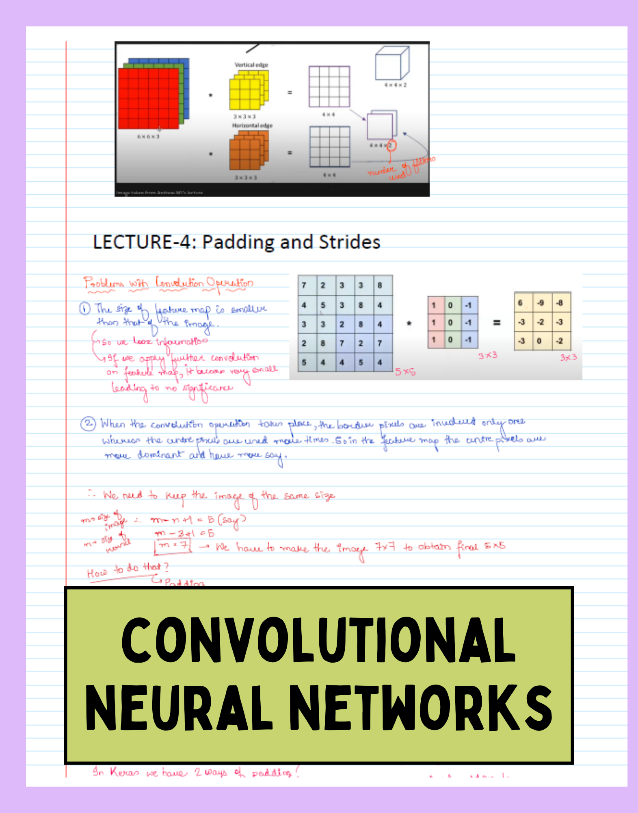
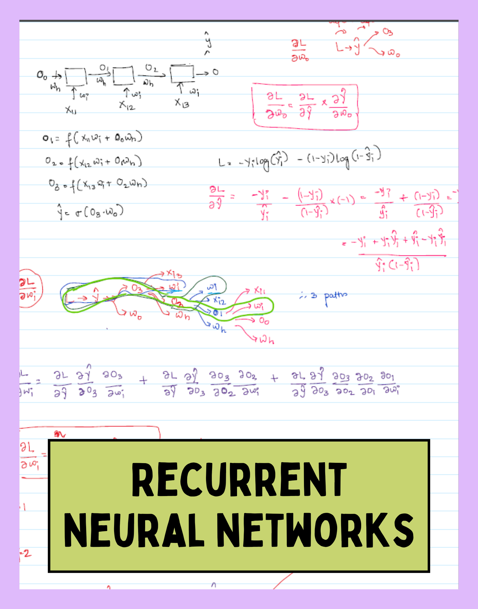
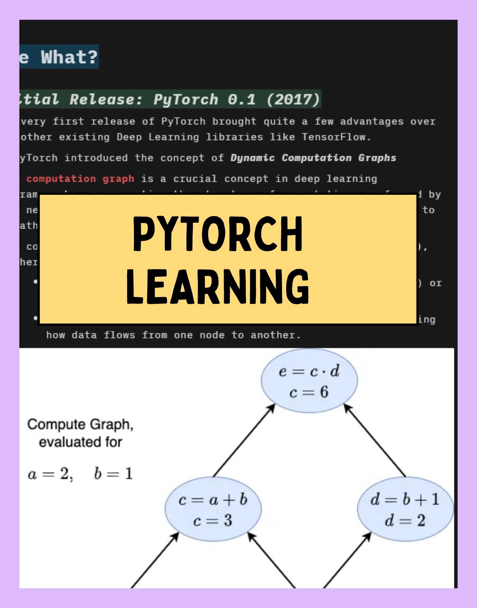

# AI Retreat: Learning Journal
I am on the journey to explore and learn different concepts on ML, DL, AI. Will keep on updating my notes and findings in this repo as my Personal Journal 

This repository is my personal journal of learning advanced topics in machine learning. It includes an in-depth understanding of fundamentals + additional must-read/watch recourses for more nuanced subjects.

**Currently Grinding: PyTorch**

  

## 📝 My Notes

  <table>
    <tr>
      <td>
        
         
        <a href="Deep Learning Revision Day Wise/CNN/CNN.pdf">CNN Notes</a>
      </td>
      <td>
        
         
        <a href="Deep Learning Revision Day Wise/RNN/RNN Notes.pdf">RNN Notes</a>
      </td>
      <td>
        
         
        <a href="https://neuralnomad.notion.site/PyTorch-Learning-Series-Part-1-13e60f647adc80d29e6bdd8712e7d85f?pvs=74">PyTorch</a>
      </td>
    </tr>
  </table>

## 🎯 Goals

My goals of this learning retreat includes studying: 

- [Campusx Deep Learning Playlist](https://www.youtube.com/playlist?list=PLKnIA16_RmvYuZauWaPlRTC54KxSNLtNn)
- [30 Days LLM Mastery Playlist](https://www.youtube.com/playlist?list=PLrzE9U41BOPAkhDAYL62HrNJGhvPJ0HH8)
- [Ilya Sutskever's top 30 must-read research papers](https://aman.ai/primers/ai/top-30-papers/)
- [Most of Distilled AI's Blogs](https://aman.ai/primers/ai/)
- [Artem Kirsanov's AI/ML Playlist](https://www.youtube.com/playlist?list=PLgtmMKe4spCPsxyMpg-sxf3EcbsFYlzPK)
- [Andrej Karpathy's golden Neural Net Playlist](https://www.youtube.com/playlist?list=PLAqhIrjkxbuWI23v9cThsA9GvCAUhRvKZ)
- [Krish Naik Deep Learning Playlist](https://www.youtube.com/playlist?list=PLZoTAELRMXVPGU70ZGsckrMdr0FteeRUi) ✅
- [SQL Basics to Intermediate from 365 Data Science](https://neuralnomad.notion.site/Complete-SQL-Beginner-to-Advanced-13760f647adc80fabfa9fedf6fd9b704?pvs=74) ✅
- PyTorch
- In-depth understanding/implementations of Transformers
- Going Deep Into Unsupervised DL Use cases like Autoencoders, GANs, Diffusion Models
- LLMs and related topics 
- LLM Halucination in depth
- Quantum Machine Learning
- Jax
- Energy-Based Models
